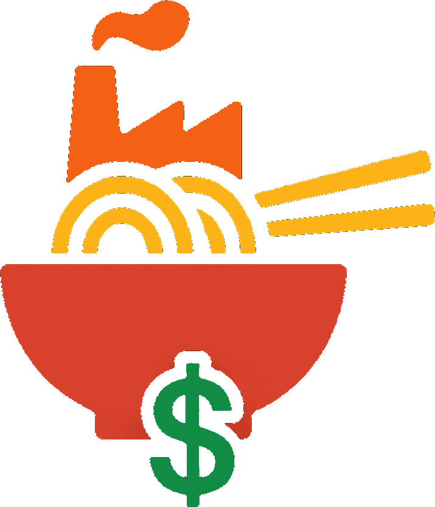

# Noodle Factory

## Overview

Noodle Factory is an absurdist roguelike card game where you manage a pasta production facility teetering on the edge of chaos. As the newly appointed factory manager, your goal is to survive as long as possible, balancing resources while dealing with increasingly bizarre pasta-related events.

## Game Features

### Core Mechanics
- **Card-Based Decision Making**: Each turn presents you with two bizarre cards that affect your factory's stats in unpredictable ways.
- **Resource Management**: Carefully balance four primary resources:
  - **Prestige**: Your factory's reputation in the pasta world
  - **Chaos**: The level of disorder in your factory (exceed 100% chaos for three turns and it's game over!)
  - **Ingredients**: Raw materials needed to produce noodles
  - **Workers**: Staff required to keep your factory running

### Key Features
- **Over 200 Unique Cards**: From "Carbonara Catastrophe" to "Pasta Particle Accelerator," each card brings absurd events to your factory.
- **Factory Upgrades**: Install permanent upgrades to improve production and gain passive bonuses.
- **Dynamic Events**: Watch your factory transform as chaos rises, with visual and audio effects that intensify.
- **Achievement System**: Over 60 achievements to unlock across multiple categories.
- **Risk & Reward**: Special "risk achievements" that offer huge benefits or devastating consequences.
- **Factory Lights**: Visual indicators of your factory's condition that react to your resource levels.
- **Adaptive Soundtrack**: Music that evolves based on your factory's chaos level.

## Installation

### System Requirements
- Windows 7/10/11
- 4GB RAM
- 200MB disk space
- 1280x720 screen resolution (minimum)

### Installation Instructions
1. Download the installer from [official website or distribution platform]
2. Run the installer and follow the on-screen instructions
3. Launch "The Noodle Factory" from your desktop or start menu

## Gameplay Tips

- Watch your chaos levels carefully - exceeding 100% chaos for three consecutive turns ends your run.
- Running out of workers or ingredients can be fatal if you don't have money to restock.
- Factory upgrades provide powerful passive bonuses but are limited to 2 at a time.
- Special effects can trigger at specific resource combinations (try having exactly 50 chaos).
- Some cards have different effects based on your current stats.
- You can sell upgrades during emergencies to gain resources and reduce chaos.
- The longer you survive, the higher your score!

© 2025 Gumbysoft. All rights reserved.

The Noodle Factory game and all associated content are proprietary and may not be reproduced, distributed, or used without explicit permission from Gumbysoft.

